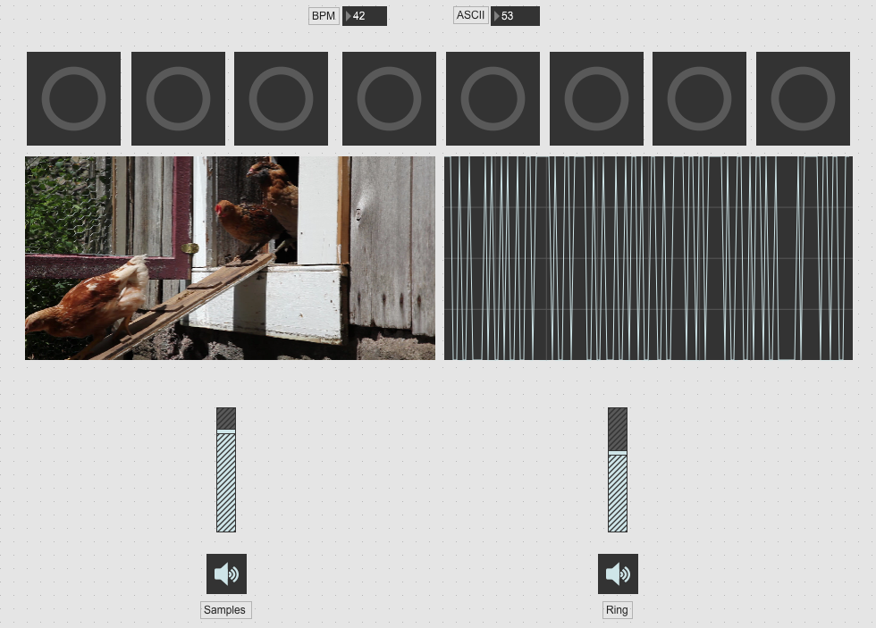

# Press Any Key

A Keyboard-controlled Step Audio/Video Sequencer Based on MAX/MSP

-------

## Introduction

The step sequencer is controlled by both the BPM and the Key 1-8 on keyboard. The sample would be immediately triggered when you hit the corresponding key, and the delay time of the chord would be modified at the same time. 

Plus, when you press any key on your keyboard, it will trigger a ring modulation with the modulator and carrier set by the ASCII number of the very key.

Pressing the "+" and "-" key would change the direction of the sequencer.

The MIDI program would be modified every time one loop finishes, so the sequencer always gives new chord progression and tone.

It is fun to press any key on the keyboard to make a jazzy sound.

-------

## Credits

All the samples and video are built in the gallery of MAX.